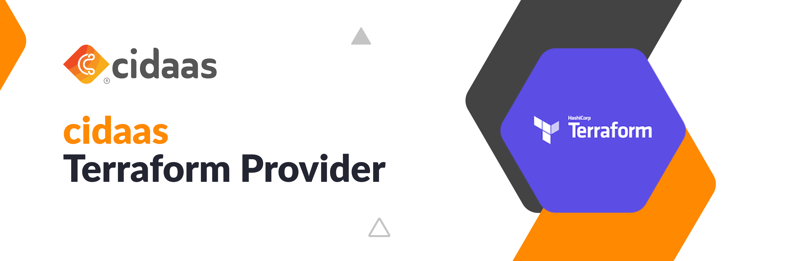

## About cidaas:
[cidaas](https://www.cidaas.com)
 is a fast and secure Cloud Identity & Access Management solution that standardises what’s important and simplifies what’s complex.

## Feature set includes:
* Single Sign On (SSO) based on OAuth 2.0, OpenID Connect, SAML 2.0 
* Multi-Factor-Authentication with more than 14 authentication methods, including TOTP and FIDO2 
* Passwordless Authentication 
* Social Login (e.g. Facebook, Google, LinkedIn and more) as well as Enterprise Identity Provider (e.g. SAML or AD) 
* Security in Machine-to-Machine (M2M) and IoT

# Cidaas Provider for Terraform

The cidaas provider for terraform is used to interact with cidaas instances. It provides resources that allow you to create Apps and Registration Page Fields as part of a Terraform deployment.

### Prerequisites

- Install Terraform in your local machine. Find steps to install Terraform for different operating system [here](https://developer.hashicorp.com/terraform/tutorials/aws-get-started/install-cli)

## Example Usage

```hcl
terraform {
    required_providers {
      cidaas = {
        version = "1.0.23"
        source  = "Cidaas/cidaas"
      }
    }
  }
```

- Setup Environment variables: client_id and client_secret must be set as environment variable in order to allow Cidaas terraform provider to complete client credentials flow and generate an access_token

  ```bash
  export TERRAFORM_PROVIDER_CIDAAS_CLIENT_ID="ENTER CIDAAS CLIENT ID"
  ```

  ```bash
  export TERRAFORM_PROVIDER_CIDAAS_CLIENT_SECRET="ENTER CIDAAS CLIENT SECRET"
  ```

- Add Cidaas Provider configuration to terraform configuration file inside Example directory

  ```hcl
  provider "cidaas" {
    redirect_uri  = "Enter redirect-uri of default app"
    base_url      = "https://terraform-cidaas-test-free.cidaas.de"
  }
  ```

## Supported Cidaas Resources

### Cidaas Custom Provider Resource

Example custom provider resource configuration

```hcl
resource "cidaas_custom_provider" "cp" {
  standard_type          = "OAUTH2"
  authorization_endpoint = "https://terraform-cidaas-test-free.cidaas.de/authz-srv/authz"
  token_endpoint         = "https://terraform-cidaas-test-free.cidaas.de/token-srv/token"
  provider_name          = "Terraform"
  display_name           = "Terraform"
  logo_url               = "https://terraform-cidaas-test-free.cidaas.de/logo"
  userinfo_endpoint      = "https://terraform-cidaas-test-free.cidaas.de/users-srv/userinfo"
  scope_display_label    = "Terraform Test Scope"
  client_id              = "add your client id"
  client_secret          = "add your cluient secret"

  scopes {
    recommended = false
    required    = false
    scope_name  = "openid"
  }
  scopes {
    recommended = false
    required    = false
    scope_name  = "profile"
  }
  scopes {
    recommended = false
    required    = false
    scope_name  = "email"
  }

  userinfo_fields {
    name               = "cp_name"
    family_name        = "cp_family_name"
    address            = "cp_address"
    birthdate          = "01-01-2000"
    email              = "cp@email.com"
    email_verified     = "true"
    gender             = "male"
    given_name         = "cp_given_name"
    locale             = "cp_locale"
    middle_name        = "cp_middle_name"
    mobile_number      = "100000000"
    nickname           = "cp_nickname"
    phone_number       = "10000000"
    picture            = "https://cp-picture.com/image.jpg"
    preferred_username = "cp_preferred_username"
    profile            = "cp_profile"
    updated_at         = "01-01-01"
    website            = "https://cp-website.com"
    zoneinfo           = "cp_zone_info"
  }
}

```

##### Cidaas App Resource

An example of App resource configuration. Here config **custom_provider_name** reads value from the resource **custom_provider**. This is an optional configuration. A custom_provide resource must be created before creating and app resource. This configuration is used to link an app resource to a custom provider.

```hcl
resource "cidaas_app" "Enter resource name" {
  client_type                     = "SINGLE_PAGE"
  allow_login_with                = ["EMAIL", "MOBILE", "USER_NAME"]
  auto_login_after_register       = true
  enable_passwordless_auth        = false
  register_with_login_information = true
  hosted_page_group               = "default"
  client_name                     = "Terraform Test"
  client_display_name             = "Terraform Test"
  company_name                    = "Widas ID GmbH"
  company_address                 = "01"
  company_website                 = "https://cidaas.com"
  allowed_scopes                  = ["openid", "cidaas:register", "profile"]
  response_types                  = ["code", "token", "id_token"]
  grant_types                     = ["client_credentials"]
  template_group_id               = "custtemp"
  redirect_uris                   = ["https://cidaas.com"]
  allowed_logout_urls             = ["https://cidaas.com"]
  fds_enabled                     = false
  login_providers                 = ["login_provider1", "login_provider2"]
  custom_provider_name            = cidaas_custom_provider.customer_provider.provider_name
}
```

```hcl
resource "cidaas_registration_page_field" "Enter resource name for resource type registration_page_fields" {
  parent_group_id      = "DEFAULT"
  is_group             = false
  data_type            = "TEXT"
  field_key            = "Enter registration_page_field name"
  required             = false
  enabled              = false
  read_only            = false
  internal             = false
  scopes               = []
  claimable            = true
  order                = 25
  field_type           = "CUSTOM"
  locale_text_locale   = "en-GB"
  locale_text_name     = "erraform-test-field"
  locale_text_language = "en"
}
```

## Import Cidaas Resources

you can import cidaas resource by running the below command. Before you can import you need to an empty terraform resource to import one. Example:

```hcl
resrouce "cidaas_custom_provider" "sample" {}

output "sample_custom_provider" {
  value = cidaas_custom_provider.sample
}
```

### Import an existing cidaas app

```ssh
terraform import cidaas_app.<resource name> client_id
```

### Import an existing cidaas custom provider

```ssh
terraform import cidaas_custom_provider.<resource name> provider_name
```

- Run Terraform commands going inside Example directory where Terraform config file main.tf is located

  1. terraform init : It will build the Terraform Cidaas Plugin/Provider.
  2. terraform Plan : It will show the plan that Terraform has to execute from the current config file(main.tf) configurations.
  3. terraform apply : The Terraform will execute the changes and the infrastructure will get provisioned.
